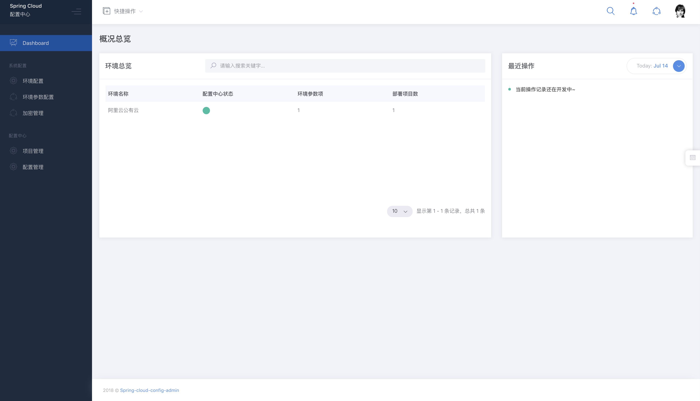
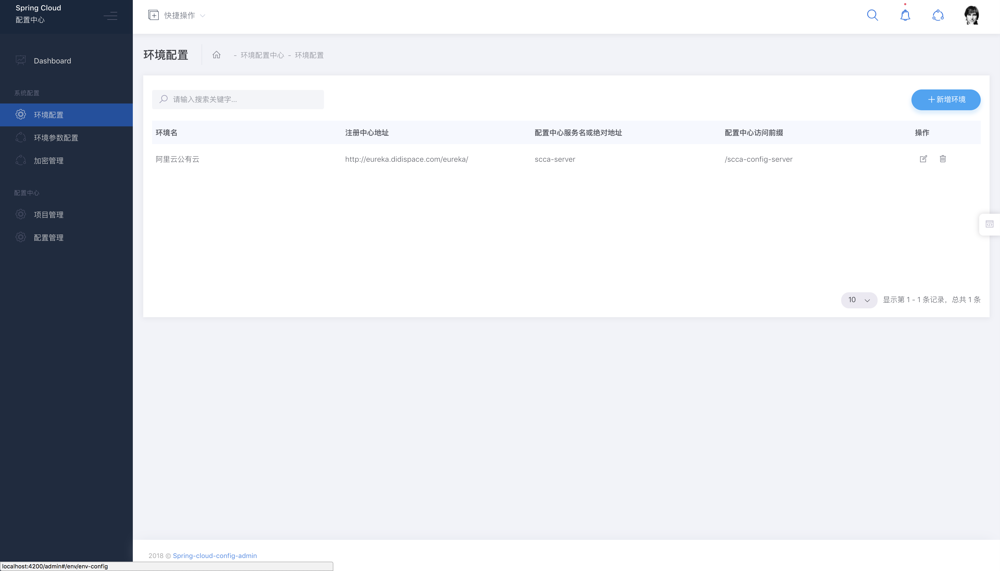
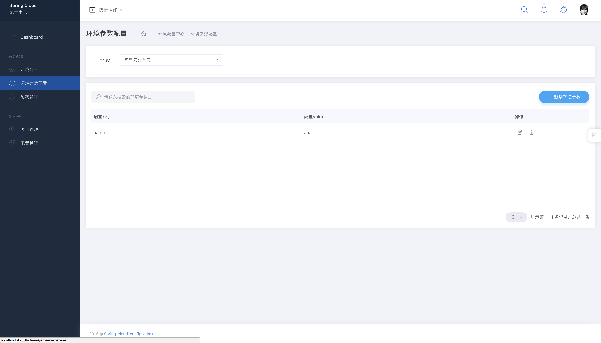
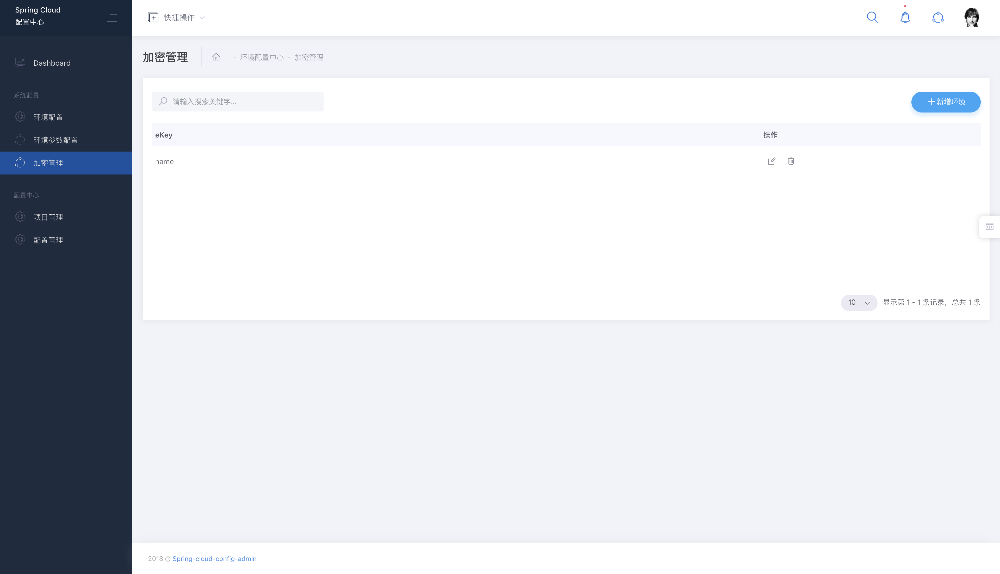
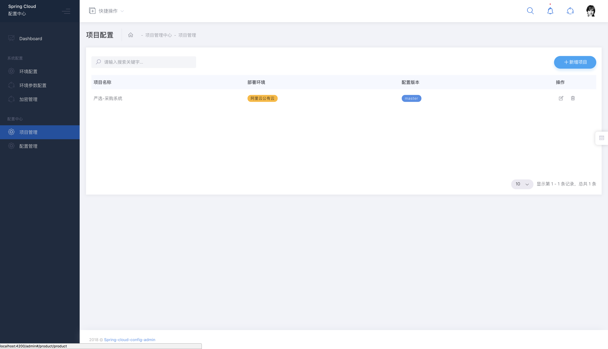
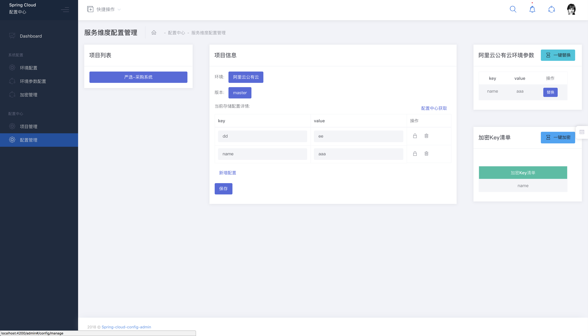

# 简介

Spring Cloud Config 的综合管理后台（简称：SCCA）的前端。

后端工程：[链接](https://github.com/dyc87112/spring-cloud-config-admin)

# 项目截图

仪表盘:

环境配置:

环境参数配置：

加密管理：

项目管理:

配置管理:

# 前端框架

1.  Angular 5.x
2.  Bootstrap 4.x
3.  响应式布局
4.  前端进行路由控制
5.  页面组件化、模块化、更好的维护性。
6.  页面路由的懒加载

# 使用文档

查看详情介绍点击：[使用文档](https://github.com/stone-jin/spring-cloud-config-admin-web/wiki)

# 贡献者

[stone-jin](https://github.com/stone-jin)
